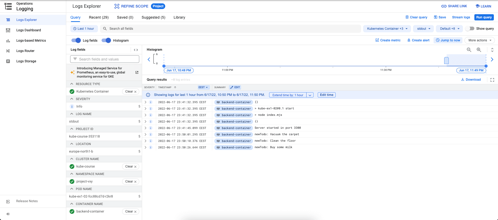
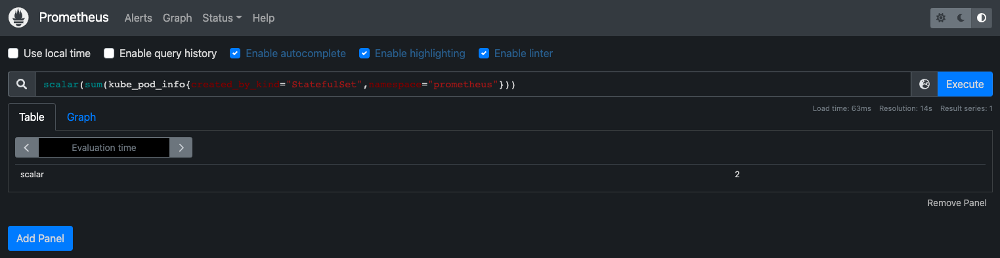

# Project vX.Y

This project includes solutions for the following exercises:

* Exercise 1.02: Project v0.1
* Exercise 1.04: Project v0.2
* Exercise 1.05: Project v0.3
* Exercise 1.06: Project v0.4
* Exercise 1.08: Project v0.5
* Exercise 1.09: More services
* Exercise 1.12: Project v0.6
* Exercise 1.13: Project v0.7
* Exercise 2.02: Project v1.0
* Exercise 2.04: Project v1.1
* Exercise 2.08: Project v1.2
* Exercise 2.09: Daily todos
* Exercise 2.10: Project v1.3
* Exercise 3.03: Project v1.4
* (Skipped) Exercise 3.04: Project v1.4.1
* (Skipped) Exercise 3.05: Project v1.4.2
* (Q/A) Exercise 3.06: DBaaS vs DIY
* (Q/A) Exercise 3.07: Commitment
* Exercise 3.08: Project v1.5
* Exercise 3.10: Project v1.6
* Exercise 4.02: Project v1.7
* Exercise 4.03: Prometheus
* Exercise 4.04: Project v1.8
* Exercise 4.05: Project v1.9


## Skipped exersices
These exercises related to separation of deployment using branch name as namespace below were skipped because I already used namespace from previous excercises for project separation instead (hard-coded namespace in most of yml files). There is a [limitation in changing namespace globally for hard-coded namespace with kustomize](https://github.com/kubernetes-sigs/kustomize/issues/880).

* Exercise 3.04: Project v1.4.1
* Exercise 3.05: Project v1.4.2

---

## Q/A exersices

In this section, please forgive my knowledge limitation if you found unreasonable somewhere.

### Exercise 3.06: DBaaS vs DIY
|Pros/Cons|DBaaS|DIY|
|-|:-:|:-:|
|Low cost & fast to spin up and run for small projects||x|
|Low cost & fast to spin up and run for big projects|x||
|Self-managed resources, hence, easier to manage node's resources|x||
|Easier to update configuration, perform backup & maintainance work, and enable high availability|x||
|Less work to hook 3rd party extensions & more features to select|x||
|Less work & cost overall if <ins>expansion</ins> is a must later on|x||
|Has service support|x||

### Exercise 3.07: Commitment
In reality, I would choose `DBaaS` if I work on company's projects following the above listed benefits. Most importantly, it brings the _peace of mind_ to me as a developer and a lot more benefits would reveil themselves as time flies. For experiment and the scope of this course, I would stay with the current setup using Postgres and `statefulset` with `volumeClaimTemplates`.

### Exercise 3.10: Project v1.6


### Exercise 4.03: Prometheus


---

GKE setup requires the following variables:

```yaml
GKE_PROJECT_ID: "Under <given-sa-name>-<6-random-digits> format"
GKE_SA: "Under <sa-name>@<project-id>.iam.gserviceaccount.com format"
GKE_SA_CREDENTIALS: "Under JSON format"
SOPS_AGE_KEY: "Under PGP format"
```